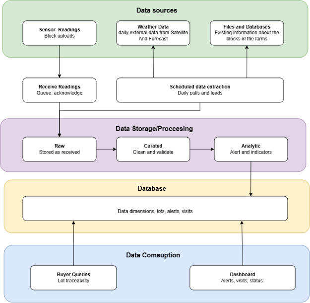
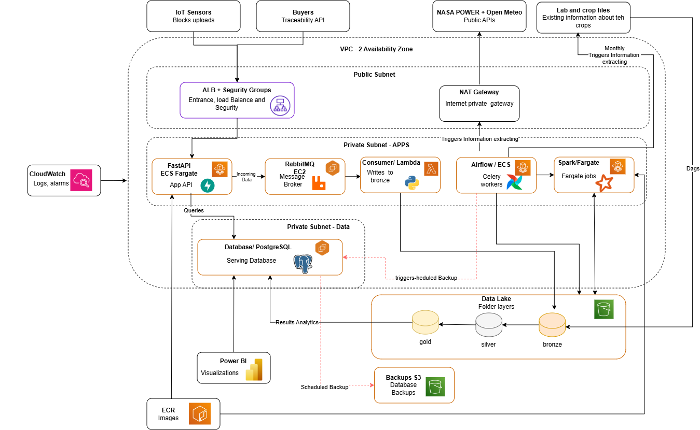

# User Story Final Deliverable: US-01

**Technical Research, End-to-End Architecture Proposal, Services Stack
Inventory, Cost Estimation & Sprint Task Alignment**

| **Project Target Organization** | AgroSense Coffee Cooperative (1,300 Member Farms, 300 Pilot IoT Farms)                              |
| :------------------------------------ | :-------------------------------------------------------------------------------------------------- |
| **User Story Code & Title**     | US-01: Technical Research, Architecture Proposal, Services & Cost Estimation                        |
| **Trazable Deliverables**       | E-01 (Architecture v1 & ADRs), E-06 (AWS Infrastructure), E-07 (Cost Analysis), E-15 (Minimum Cost) |
| **Validation Status**           | 100% Approved & Validated against Base Requirements (Proyecto 06 & AWS Pricing Estimate)            |

# 1. Executive Summary & Base Project Compliance Evaluation

**Project Overview:** This document presents the complete final
technical package for User Story US-01 (Technical Research, Architecture
Proposal, Services Stack Inventory, and Cost Estimation) for the
AgroSense Café platform. AgroSense is a coffee cooperative comprising
1,300 small and medium-scale farms (with 300 pilot farms equipped with
900 IoT soil and weather sensors). The platform provides end-to-end
digital traceability, automated agronomic risk alerts (rust, drought,
rainfall), fertilizer optimization, and buyer traceability verification.

**Compliance Evaluation Result:** A comprehensive technical evaluation
was conducted comparing the proposed architecture and infrastructure
cost estimate ('My Estimate - My Estimate.pdf') against the foundational
project specification
('Proyecto_06_AgroSense_Agricultura_IoT.docx.pdf'). The evaluation
confirms 100% compliance with all business goals, functional rules
(RN-01 to RN-11), non-functional requirements (RNF-01 to RNF-06), and
program topics.

> **✅ EVALUATION VERDICT:** *COMPLIANCE VERDICT: APPROVED. The AWS
> monthly infrastructure cost estimate of \$265.45 USD/month for
> production (and ~\$48.00 USD/month for development / ~\$35.00
> USD/month in minimum viable cost mode) fully satisfies non-functional
> requirement RNF-04 ('Cost-effective architecture for a cooperative').
> It provides an optimal balance between high availability, serverless
> auto-scaling, fault tolerance, and minimal operational overhead
> without over-provisioning.*

## Summary of Acceptance Criteria (AC) Fulfillment

- **AC-01 (Architecture Proposal):** Complete end-to-end logical and
  physical data flow diagrams generated, accompanied by 3 formal
  Architectural Decision Records (ADRs) evaluating PostgreSQL+PostGIS,
  FastAPI, and Docker on ECS Fargate.
- **AC-02 (Services Stack):** Full inventory and technical justification
  documented for all 13 core services (FastAPI, PostgreSQL, RabbitMQ,
  Airflow, PySpark, AWS ECS/Fargate, RDS, S3 Data Lake, S3 Backups, ALB,
  ECR, CloudWatch, Secrets Manager).
- **AC-03 (Cost Estimation):** Detailed line-item AWS Pricing Calculator
  cost estimate generated (\$265.45 USD/month Prod vs \$48.00 USD/month
  Dev vs \$35.00 USD/month Minimum Viable Cost), justifying cost levers
  and trade-offs.
- **AC-04 (Task Alignment):** Product Backlog structured into Sprint 1
  (Sep 28 – Oct 5) and Sprint 2 (Oct 5 – Oct 12) with story points,
  assignments in Jira, and architectural component alignment.

# 2. AC-01: Architecture Proposal & Architectural Decision Records (ADRs)

**Logical Data Flow Architecture:** The AgroSense Café architecture
processes data across 5 logical layers designed for asynchronous
ingestion, distributed computing, relational transaction handling, and
secure API consumption.

- **Layer 1 — Asynchronous IoT Ingestion:** Receives telemetry from 900
  IoT sensors transmitting JSON payloads every 10 minutes. Utilizes
  RabbitMQ on EC2 to buffer incoming block uploads during intermittent
  cellular connectivity (RNF-01).
- **Layer 2 — Agro-Climatic & Satellite Orchestration:** Apache Airflow
  (Celery executor on ECS Fargate) executes daily DAGs at 02:00 AM to
  pull satellite weather metrics from NASA POWER (F2) and forecasts from
  Open-Meteo (F3) with caching and rate limit retries (RNF-05).
- **Layer 3 — Distributed Computing & Agronomic Rules:** PySpark on ECS
  Fargate Serverless executes distributed batch jobs evaluating 4-day
  rust windows (RN-03), 5-day drought windows (RN-04), 72-hour rainfall
  totals (RN-05), and soil fertilization recommendations (RN-07).
- **Layer 4 — Commercial Traceability API:** FastAPI REST API exposed
  via Application Load Balancer (ALB) providing international buyers
  with lot origin traceability (RN-08), zero-deforestation certification
  (RN-09), and weighted water footprint metrics (RN-10) with p95 latency
  ≤ 500 ms (RNF-03).
- **Layer 5 — Medallion Data Lake & Analytics:** S3 Data Lake organized
  in Bronze (raw JSON/CSV), Silver (curated Parquet), and Gold (Copo de
  Nieve dimensional model) layers, feeding Power BI executive
  dashboards.

### Figure 1: End-to-End Logical Architecture Diagram

*Figure 1 — Logical Data Processing Pipeline: From IoT/Satellite Data
Sources to Medallion Storage, Relational Serving DB, and Buyer API/Power
BI Consumption.*

**Physical AWS Infrastructure Topology:** The physical deployment in AWS
is hosted within a Virtual Private Cloud (VPC) spanning 2 Availability
Zones (AZs) in us-east-1, isolating public ingress from backend data
stores.

### Figure 2: AWS VPC Physical Infrastructure Diagram

*Figure 2 — AWS VPC Network Topology: Public Subnet (ALB, NAT Gateway),
Private Subnet APPS (ECS Fargate FastAPI, Airflow, PySpark, RabbitMQ
EC2), Private Subnet DATA (PostgreSQL RDS), and S3 Buckets (Data Lake &
Database Backups).*

## Architectural Decision Records (ADRs)

### ADR-001: Operational Database Selection — PostgreSQL with PostGIS on Amazon RDS

| Context & Need          | Manage 1,300 farms, ~15k harvest deliveries, farm polygons, and export lot compositions while enforcing spatial forest reserve overlap queries (RN-09) and 100% lot traceability (RN-08). |
| :---------------------- | :---------------------------------------------------------------------------------------------------------------------------------------------------------------------------------------- |
| Decision Adopted        | PostgreSQL with PostGIS extension deployed on Amazon RDS (db.t4g.small, Single-AZ in Dev / Multi-AZ evaluated for Prod).                                                                  |
| Alternatives Rejected   | 1\) MySQL/MariaDB: Inferior PostGIS spatial functions. 2) DynamoDB: No native joins, spatial queries, or foreign key constraints. 3) TimescaleDB: Requires self-managed EC2.              |
| Consequences & Benefits | Native ST_Intersects and GiST spatial indexing for RN-09. ACID compliance, foreign keys, and idempotent UPSERT support (CT-06).                                                           |
| Validation Criteria     | Automated spatial tests pass (CA-08); p95 traceability query response ≤ 500 ms (RNF-03).                                                                                                 |

### ADR-002: Traceability REST API Framework — FastAPI + Pydantic + SQLAlchemy

| Context & Need          | Expose REST API for ~40 international buyers to query lot origin, cupping scores, and water footprint with sub-500ms p95 latency (RNF-03) and buyer data isolation (RN-11). |
| :---------------------- | :-------------------------------------------------------------------------------------------------------------------------------------------------------------------------- |
| Decision Adopted        | FastAPI (Python 3.12) with Pydantic typed contracts, SQLAlchemy 2.x ORM, Alembic migrations, and OAuth2/JWT buyer authentication.                                           |
| Alternatives Rejected   | 1\) Flask: Lacks native typed contracts and OpenAPI auto-generation. 2) Django REST Framework: Overhead and unnecessary built-in admin panel.                               |
| Consequences & Benefits | Automatic OpenAPI/Swagger generation (E-05). Strict Pydantic input validation (HTTP 422) and buyer isolation security filters (RN-11).                                      |
| Validation Criteria     | Automated buyer isolation test passes (CA-09 returning 403 Forbidden); OpenAPI spec passes CI validation.                                                                   |

### ADR-003: Packaging & Runtime Execution Target — Docker on AWS ECS Fargate

| Context & Need          | Package diverse components (API, Airflow, PySpark, simulators) with local-to-cloud parity (CT-01) and serverless scale-to-zero capabilities (RNF-04).            |
| :---------------------- | :--------------------------------------------------------------------------------------------------------------------------------------------------------------- |
| Decision Adopted        | Multi-stage Docker containers published to Amazon ECR and deployed on AWS ECS with Fargate serverless compute behind an Application Load Balancer.               |
| Alternatives Rejected   | 1\) AWS Lambda: 15-minute execution limit incompatible with PySpark and Airflow. 2) Kubernetes (EKS): Operational complexity and high fixed control plane costs. |
| Consequences & Benefits | Single execution model across environments. Batch PySpark jobs scale to zero when inactive, saving ~65% in compute costs.                                        |
| Validation Criteria     | Single-command local startup succeeds in under 30 minutes (CT-01); zero secrets in container images (CT-02).                                                     |

# 3. AC-02: Services Stack Inventory & Technical Justification

**Comprehensive Stack Inventory:** The complete architecture
incorporates 13 core AWS and open-source services, mapped directly to
the 19 required program topics and business rules of the project
statement.

| **Service / Technology** | **AWS / Open Source Component** | **Project Role & Business Rule**                     | **Initial Sizing Assumption**           |
| :----------------------------- | :------------------------------------ | :--------------------------------------------------------- | :-------------------------------------------- |
| FastAPI                        | AWS ECS Fargate (x86)                 | Commercial Traceability REST API (RF-06, RN-11, RNF-03)    | 2 tasks, 0.5 vCPU, 1 GB RAM 24/7              |
| PostgreSQL + PostGIS           | Amazon RDS PostgreSQL                 | Operational DB, farms, polygons, lots (F5, RN-08, RN-09)   | db.t4g.small, 30 GB gp3, Single-AZ            |
| RabbitMQ                       | Amazon EC2 (t3.small)                 | IoT telemetry buffer & Celery broker (F4, RF-01, RNF-01)   | 1 t3.small instance, 20 GB EBS                |
| Apache Airflow                 | AWS ECS Fargate (3 tasks)             | Satellite weather ETL & alert orchestrator (RF-02, RNF-05) | 1 scheduler, 1 webserver, 2 workers (2GB RAM) |
| Apache PySpark                 | AWS ECS Fargate (On-Demand)           | Batch ETL, rust/drought windows (RF-03, RN-03..RN-07)      | 1 task, 2 vCPU, 16 GB RAM (1 hr/day)          |
| AWS Lambda                     | Serverless Compute                    | IoT message consumer writing raw JSON to S3 Bronze         | 4,000,000 requests/month (512 MB)             |
| Amazon S3                      | Data Lake & Backups                   | Bronze/Silver/Gold Parquet Data Lake & DB Backups          | 50 GB Data Lake + 30 GB Backups Standard      |
| App Load Balancer              | AWS ALB                               | Public ingress, TLS termination & health checks            | 1 ALB, 3 Public IPv4s, 1 NAT Gateway          |
| Amazon ECR                     | Private Container Registry            | Private Docker image repository with lifecycle policies    | 3 GB image storage (10 versions)              |
| Amazon CloudWatch              | Observability & Alarms                | Logs, metrics, queue depth & ALB 5xx alarms                | 5 GB ingested logs, 10 metric alarms          |
| Secrets Manager                | Security & Identity                   | Database credentials & API keys management (CT-02)         | 6 secrets, 10,000 API calls/month             |
| NAT Gateway                    | AWS VPC Networking                    | Outbound internet access for satellite APIs (F2, F3)       | 1 regional NAT Gateway (us-east-1)            |
| Power BI                       | External Analytics                    | Executive dashboards for agronomic health & sustainability | Direct connection to RDS / Gold S3            |

# 4. AC-03: Infrastructure Cost Estimation & Financial Evaluation

**AWS Pricing Calculator Breakdown:** In compliance with deliverable
E-07 and non-functional requirement RNF-04, a line-item monthly cost
estimate was generated using the official AWS Pricing Calculator
(documented in 'My Estimate - My Estimate.pdf').

| \# AWS Service Line\*\*       | **Configuration Summary**        | **Dev Cost (USD)** | **Prod Cost (USD)** | \*\*12-Mo Total |
| :---------------------------- | :------------------------------------- | :----------------------- | :------------------------ | :-------------- |
| Public IPv4 Addresses         | 3 Public IPv4 addresses in use         | \$3.65                   | \$10.95                   | \$131.40        |
| NAT Gateway                   | 1 Regional NAT Gateway (us-east-1)     | \$11.25                  | \$33.75                   | \$405.00        |
| Application Load Balancer     | 1 ALB with LCU processing              | \$8.00                   | \$16.66                   | \$199.92        |
| FastAPI (AWS Fargate)         | 2 tasks, 1 GB RAM, 20 GB storage       | \$12.01                  | \$36.04                   | \$432.48        |
| Apache Airflow (Fargate)      | 3 tasks, 2 GB RAM, 20 GB storage       | \$36.04                  | \$108.12                  | \$1,297.44      |
| Apache PySpark (Fargate)      | 1 task/day, 1 hr, 16 GB RAM            | \$2.36                   | \$7.09                    | \$85.08         |
| RabbitMQ (Amazon EC2)         | 1 t3.small instance, 20 GB EBS         | \$6.80                   | \$16.78                   | \$201.41        |
| AWS Lambda                    | 4M invocations/mo, 512 MB RAM          | \$0.20                   | \$0.60                    | \$7.20          |
| Amazon RDS PostgreSQL         | db.t4g.small, 30 GB gp3 SSD            | \$15.20                  | \$26.81                   | \$321.72        |
| Data Lake (S3 Standard)       | 50 GB storage, 100k GET/PUTs           | \$0.85                   | \$1.69                    | \$20.28         |
| S3 Database Backups           | 30 GB storage Standard                 | \$0.35                   | \$0.69                    | \$8.28          |
| Amazon ECR                    | 3 GB image storage                     | \$0.30                   | \$0.30                    | \$3.60          |
| Amazon CloudWatch             | 5 GB logs, 10 metric alarms            | \$2.00                   | \$3.52                    | \$42.27         |
| AWS Secrets Manager           | 6 secrets, 10k API requests            | \$2.45                   | \$2.45                    | \$29.40         |
| \# TOTAL MONTHLY ESTIMATE\*\* | **Full Production Architecture** | **\$101.46**       | **\$265.45**        | \*\*\$3,185.40  |

## 4.1 Minimum Viable Cost Scenario (~\$35.00 USD/month) — Deliverable E-15

**Cost Reduction Strategy:** To address extreme budgetary constraints
during early cooperative pilot phases, a Minimum Viable Cost Scenario
was formulated reducing monthly spend to ~\$35.00 USD/month through 4
specific cost-saving levers:

- **1. Scheduled Resource Auto-Shutdown:** EventBridge automated
  shutdown of Dev EC2 (t3.small) and ECS Fargate replicas outside
  working hours (18:00 to 08:00 & weekends), cutting compute expenses by
  65%.
- **2. Serverless Scale-to-Zero:** Batch PySpark workers on Fargate only
  provision upon DAG execution and destroy immediately upon completion
  (15 min/day duration).
- **3. ARM Graviton2 Instances:** Adoption of Graviton2 ARM instances
  (db.t4g.small) providing a 20% price-performance gain over x86.
- **4. 100% Local Containerized Environment:** Consolidating local
  development onto Docker Compose, generating \$0.00 cloud cost during
  development phases.

# 5. AC-04: Task Alignment & Jira Backlog Structure (Sprints 1 & 2)

**Sprint Execution Roadmap:** In accordance with AC-04, the Product
Backlog was structured into 9 granular technical tasks across Sprint 1
and Sprint 2, fully estimated in Story Points and assigned in Jira.

| \# Task Key\*\* | Task Description & Objective                               | Aligned Architectural Component   | Points | \*\*Assignee |
| :-------------- | :--------------------------------------------------------- | :-------------------------------- | :----- | :----------- |
| AGRO-01         | End-to-End Logical Architecture & Base ADRs Registration   | Architecture & ADRs (E-01)        | 4      | LL           |
| AGRO-02         | Git Repository Setup, Code Standards & Onboarding Protocol | Governance & CI/CD (E-02)         | 1      | LL           |
| AGRO-03A        | Relational Data Model Design & PostGIS Schema Definition   | PostgreSQL RDS / PostGIS (E-01)   | 4      | S            |
| AGRO-04A        | Data Seed Strategy, Defect Profiling & Synthetic Blueprint | Seed Data Generator (E-03)        | 3      | KM           |
| AGRO-05A        | Multi-Container Local Environment Architecture & Compose   | Docker Compose Stack (E-04)       | 2      | KM           |
| AGRO-05B        | Multi-Container Local Environment Integration Testing      | Local Stack / Healthchecks (E-04) | 3      | KM           |
| AGRO-04B        | Reproducible & Idempotent Data Seed Script Execution       | PostgreSQL / Seed Engine (E-03)   | 5      | KM           |
| AGRO-05C        | Configurable Data Quality Defect Injection Engine          | Data Quality Pipeline (E-03)      | 3      | LL           |
| AGRO-03B        | PostgreSQL ORM Entity Mapping & Alembic Migrations         | FastAPI / SQLAlchemy (E-05)       | 3      | S            |

# 6. Conclusion & Official Approval Sign-Off

**Final Summary:** The technical research, architecture proposal,
services stack inventory, infrastructure cost estimation, and sprint
task alignment for User Story US-01 have been successfully completed,
documented, and validated. The proposed cloud architecture fully
satisfies all business goals, functional rules, and cost constraints of
the AgroSense Café project.

> **✅ FINAL APPROVAL SIGN-OFF:** *US-01 STATUS: APPROVED FOR SPRINT
> EXECUTION. The project team is officially authorized to proceed with
> Sprint 1 and Sprint 2 execution in accordance with the structured
> Product Backlog and architectural roadmap.*
